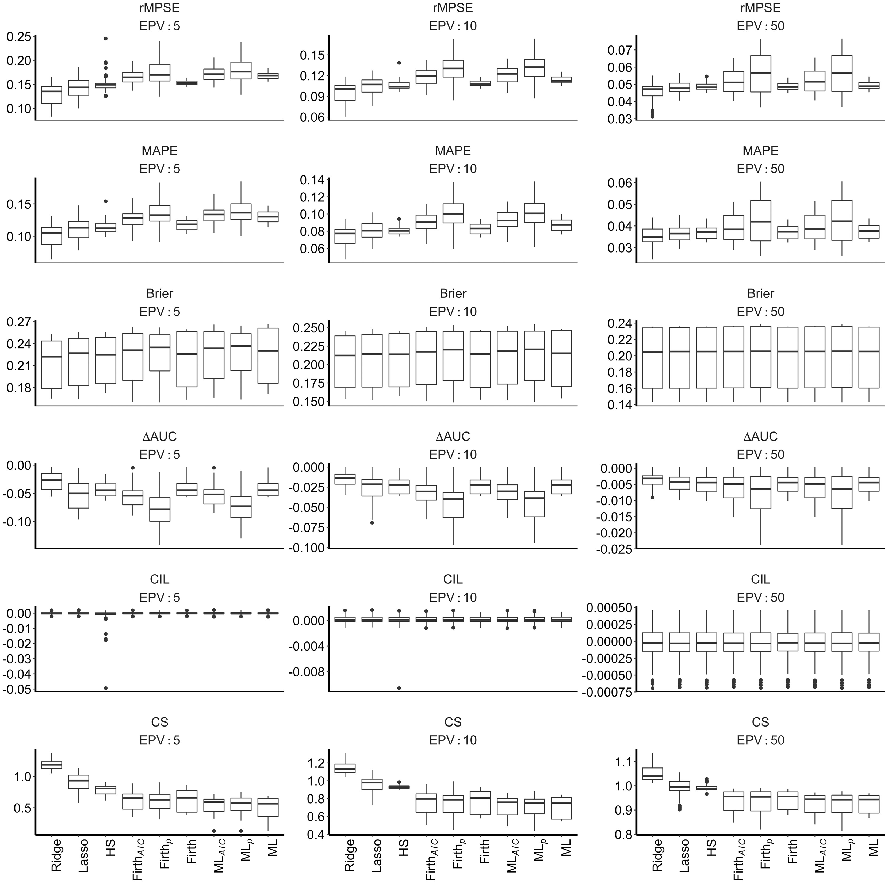

---
title: "MC Model Comparisons"
author: "Group 3: Andi Mellyn, Jessica Reyes, Hope Winsor"
date: "2025-12-01"
output:
  pdf_document: default
  html_document: default
---
\colorlet{shadecolor}{gray!10}
```{r setup, include=FALSE}
library(knitr)
library(tidyverse)
library(MASS)
library(GGally)
library(tidymodels)
library(glmnet)
library(pROC)
library(randomForest)
library(dplyr)
library(here)

knitr::opts_chunk$set(echo = TRUE, message = FALSE, warning = FALSE, tidy = FALSE)
```

\newcommand{\hstart}{ \colorlet{shadecolor}{green!20}
\begin{shaded} }
\newcommand{\hstop}{  \end{shaded} \colorlet{shadecolor}{gray!10}}

\newcommand{\pstart}{ \colorlet{shadecolor}{gray!20}
\begin{shaded} }
\newcommand{\pstop}{  \end{shaded} \colorlet{shadecolor}{gray!10}}

```{r}
# helper files so we don't rerun data simulations
mle_path   <- here("MLE_Simulation.csv")
ridge_path <- here("ridge_mc_testing_results.csv")
rf_path    <- here("RandomForest_Simulation.csv")

ridge_extra_path <- here("simulations_rmse_mae", "ridge_simulation_extra_values.csv")
mle_extra_path   <- here("simulations_rmse_mae", "mle_simulation_extra_values.csv")
rf_extra_path    <- here("simulations_rmse_mae", "random_forest_simulation_extra_values.csv")

```


\hstart

# Maximum Liklihood, Ridge, & Random Forest: A Monte Carlo Model Comparison

\hstop

\hstart

## Source functions and simulated data for model comparisons

\hstop

```{r source functions}
# simulate data -> logistic regression

simulate_logit <- function(N, P, rho, beta_pattern) {
  
  # Predictor distribution 
  # Correlation = rho (0 or 0.5)
  Sigma <- matrix(rho, P, P)
  diag(Sigma) <- 1
  
  X <- mvrnorm(n = N, mu = rep(0, P), Sigma = Sigma)
  
  # Predictor effects 
  if (beta_pattern == "equal") {
    beta <- rep(0.5, P)
    
  } else if (beta_pattern == "strong") {
    beta <- c(1.0, rep(0.2, P-1))      # 1 strong effect
    
  } else if (beta_pattern == "noise") {
    beta <- c(0, rep(0.3, P-1))        # first predictor is noise
    
  } else if (beta_pattern == "halfnoise") {
    beta <- c(rep(0, P/2), rep(0.3, P/2))  # first half noise
    
  } else {
    stop("Unknown beta pattern")
  }
  
  # Linear predictor + logistic link
  eta <- X %*% beta
  pi  <- 1/(1 + exp(-eta))
  
  # Binary outcome from Bernoulli
  y <- rbinom(N, size = 1, prob = pi)
  
  data.frame(y = y, X)
}

```

\hstart

## Background

\hstop

\pstart

Binary logistic regression is a common method for developing clinical prediction models. Traditionally, guidance on choosing an appropriate sample size has relied on the concept of events per variable (EPV), defined as the ratio of the number of outcome events to the number of degrees of freedom, think signal to noise ratio. The "best" EPV value has been $\ge 10$. In practice, EPV is used to determine both the minimum sample size required for a study and the maximum number of predictors that can be included in a model.

The study *Sample size for binary logistic prediction models: Beyond events per variable criteria* challenges the adequacy of this rule by examining whether EPV is truly the primary driver of out-of-sample predictive performance. Using a large Monte Carlo simulation study, van Smeden et al. evaluated predictive accuracy, calibration slope, AUC, and brier scores across 4,032 different combinations of data-generating scenarios run on 7 different models including maximum likelihood, backwards subset selection, firth's penalized likelihood, heuristic shrinkage, ridge, and LASSO. Their results show that EPV alone has a weak relationship with predictive performance.

For our project, we focused on a subset of original simulation design. We replicated the core comparison between maximum likelihood and ridge logistic regression to examine how shrinkage affects predictive performance under varying EPV conditions. In addition, we extended the original framework by incorporating a random forest classifier, allowing us to assess whether a non-parametric machine learning approach exhibits similar sensitivity to EPV and sample size. By comparing these three modeling strategies under a shared simulation structure, we aimed to evaluate whether the limitations of EPV observed in logistic regression also persist in more flexible predictive models.

\pstop

\hstart

## 1. Maximum Liklihood

\pstart

Maximum likelihood estimation showed strong sensitivity to EPV, predictor noise, and correlation structure. 

At low EPV, MLE exhibited substantial variability and degreaded predictive performance in the presence of noise predictors, consistent with overfitting. 

Performance stablized as EPV increased, with MLE achieving efficient and low-variance estimates at EPV=50. 

In contrast to Ridge regression, MLE provides no adaptive mechanism to control variance or penalize irrelevant predictors, making it less reliable in small-sample or noisy settings.

\pstop

\hstop

```{r maximum likelihood}
# Maximum Likelihood
# Data Simulation Function

data_simulation_function <- function(N, P, rho, beta_pattern) {
  Sigma <- matrix(rho, P, P)
  diag(Sigma) = 1
  
  X <- mvrnorm(n = N, mu = rep(0, P), Sigma = Sigma)
  
  # Set coefficients
  if (beta_pattern == "equal") {
    beta <- rep(0.5, P)
  } else if (beta_pattern == "strong") {
    beta <- c(1, rep(0.2, P-1))
  } else if (beta_pattern == "noise") {
    beta <- c(0, rep(0.3, P-1))
  } else if (beta_pattern == "halfnoise") {
    beta <- c(rep(0, P/2), rep(0.3, P/2))
  } else stop("Unknown beta pattern")
  
  eta <- X %*% beta
  p <- 1 / (1 + exp(-eta))
  
  y <- rbinom(N, 1, p)
  
  data.frame(y = y, X)
}

```

```{r}
# Model Fitting

model_fitting_function <- function(train_data) {
  glm(y ~ ., data = train_data, family = binomial)
}

```

```{r}
# Model Assessment function

model_assessment_function <- function(model, test_data) {
  probs <- predict(model, newdata = test_data, type = "response")
  
  auc_val <- auc(test_data$y, probs)
  brier <- mean((test_data$y - probs)^2)
  
  tibble(
    AUC = as.numeric(auc_val),
    Brier = brier
  )
}

```

```{r}

fit_logistic_mle <- function(dat) {
  glm(y ~ ., data = dat, family = binomial)
}

evaluate_mle_model <- function(fit, dat) {
  probs <- predict(fit, newdata = dat, type = "response")
  auc_val <- auc(dat$y, probs)
  brier <- mean((dat$y - probs)^2)
  
  tibble(AUC = as.numeric(auc_val), Brier = brier, lambda = NA)
}

```


```{r mle test run}
# testing the mle model for one run

set.seed(400)

# simulating one dataset 
dat_mle <- data_simulation_function(N = 1000, P = 8, rho = 0.5, beta_pattern = "strong")
fit_mle <- model_fitting_function(dat_mle)

mle_fit <- model_fitting_function(dat_mle)
mle_summary <- model_assessment_function(fit_mle, dat_mle)

mle_summary

```

```{r mle_mc, eval=FALSE}

set.seed(400)

# Simulation loop

EPV_vals <- c(5, 10, 50)
event_frac <- 0.5    

P_vals <- c(4, 8, 12)
rho_vals <- c(0, 0.5)
beta_patterns <- c("equal", "strong", "noise", "halfnoise")

B <- 10  

results_list <- list()
iter <- 1

for (EPV in EPV_vals) {
  for (P in P_vals) {
    for (rho in rho_vals) {
      for (bp in beta_patterns) {
        for (b in 1:B) {
          
          # Determine sample sizes 
          N  <- ceiling((EPV * P) / event_frac)
          N_star <- ceiling(5000 / event_frac)   
          
          # Training data 
          train_data <- data_simulation_function(N, P, rho, bp)
          
          # Test data
          test_data  <- data_simulation_function(N_star, P, rho, bp)
          
          # fit model
          fit_model <- model_fitting_function(train_data)
          
          # evaluate model
          metrics <- model_assessment_function(fit_model, test_data)
          
          metrics$model <- "MLE"  
          
          # metadata
          metrics <- metrics %>%
            mutate(
              model = "MLE",
              EPV = EPV,
              P = P,
              rho = rho,
              beta_pattern = bp,
              sim = b
            )
          
          # results
          results_list[[iter]] <- metrics
          iter <- iter + 1
        }
      }
    }
  }
}
results_df_mle <- dplyr::bind_rows(results_list); results_df_mle
write.csv(results_df_mle, mle_path, row.names = FALSE)

```

```{r read mle csv}
# read file

mle_results <- read.csv(mle_path)

```

```{r}

roc_obj <- roc(dat_mle$y, predict(fit_mle, newdata = dat_mle, type="response"))
plot(roc_obj, col="rosybrown", lwd=2)

```

```{r mle calibration}
# MLE calibration plot

cal_df <- dat_mle %>%
  mutate(prob = predict(fit_mle, newdata = dat_mle, type="response"),
         decile = ntile(prob, 10)) %>%
  group_by(decile) %>%
  summarize(obs = mean(y), pred = mean(prob))

ggplot(cal_df, aes(pred, obs)) +
  geom_point(size = 3) +
  geom_line() +
  geom_abline(slope = 1, intercept = 0, color = "yellow4", lty = 2) +
  ylim(0,1) + xlim(0,1) +
  ggtitle("Calibration Plot")

```

\hstart

## 2. Ridge Regression

\hstop

\pstart

Ridge logistic regression was included to evaluate the effect of coefficient shrinkage on predictive performance under varying EPV conditions. Unlike maximum likelihood estimation, ridge regression applies an $L_2$ penalty to the regression coefficients, shrinking them towards zero while retaining all predictors in the model. This penalty stabilizes coefficient estimates in settings with limited sample size, correlated predictors, or for when conditions under which maximum likelihood estimation is known to be unstable.

In this study, ridge regression models were fit using standardized predictors, and the strength of the penalty, $\lambda$, was automatically generated via cross-validation. This allows the degree of shrinkage to adapt depending on the other factors. As a result, ridge regression provides a useful contrast to maximum likelihood by trading small increases in bias for small reductions in variance making it an ideal benchmark.


\pstop

```{r ridge regression}
# ridge regression

fit_logistic_ridge <- function(dat) {
  # dat: data.frame with first column y and the rest predictors
  
  X <- as.matrix(dat[ , -1])  # all columns except the first
  y <- dat$y                  # first column is y
  
  # alpha = 0 -> ridge penalty
  cvfit <- cv.glmnet(
    x = X,
    y = y,
    alpha = 0, 
    family = "binomial"
  )
  
  cvfit
}

```

```{r evaluate ridge model}
# ridge-specific evaluate model
# evaluating AUC and brier scores

evaluate_ridge_model <- function(cvfit, dat) {
  X <- as.matrix(dat[ , -1])
  y <- dat$y
  
  # lambda.min from CV (the value that minimizes the error)
  probs <- predict(cvfit, newx = X, type = "response", s = "lambda.min")
  
  auc_val <- pROC::auc(y, probs)
  brier <- mean((y - probs)^2)
  
  tibble::tibble(
    AUC = as.numeric(auc_val), # AUC: area under the ROC curve
    Brier = brier, # brier: measure of the accuracy of probabilistic predictions
    lambda = cvfit$lambda.min
  )
}

```

```{r test run}
# testing the ridge model for one run

set.seed(400)

# simulating one dataset 
dat_test <- simulate_logit(N = 1000, P = 8, rho = 0.5, beta_pattern = "strong")

ridge_fit <- fit_logistic_ridge(dat_test)
ridge_summary <- evaluate_ridge_model(ridge_fit, dat_test)

ridge_summary

```

```{r ridge_mc, eval=FALSE}
# Monte Carlo simulation settings (subset of Van Calster et al. design)

EPV_vals <- c(5, 10, 50)    # subset -> research study uses 7 values
event_frac <- 0.5           # subset -> research study uses 4 fractions
P_vals <- c(4, 8, 12)       # same p-vals as study
rho_vals <- c(0, 0.5)       # same continuous predictors
beta_patterns <- c("equal", "strong", "noise", "halfnoise")   # same beta patterns

B <- 10  # number of Monte Carlo repetitions per condition


# Monte Carlo loop for ridge regression

set.seed(400)

ridge_results <- list()

iter <- 1

for (EPV in EPV_vals) {
  for (P in P_vals) {
    for (rho in rho_vals) {
      for (bp in beta_patterns) {
        for (b in 1:B) {
          
          # compute sample size N from EPV formula:
          # EPV = (N * event_frac) / P => N = EPV * P / event_frac
          N <- ceiling(EPV * P / event_frac)
          
          ## NEW FOR TESTING
          N_star <- ceiling(5000 / event_frac)
          
          # NEW FOR TESTING: SIMULATE TRAINING & TESTING DATA
          df_train <- simulate_logit(N = N, P = P, rho = rho, beta_pattern = bp)
          df_test  <- simulate_logit(N = N_star, P = P, rho = rho, beta_pattern = bp)
        
          # simulate one dataset -> USED ON TRAINING
          dat <- simulate_logit(N = N, P = P, rho = rho, beta_pattern = bp)
        
          # fit ridge model -> NEW fit on df_train
          ridge_fit <- fit_logistic_ridge(df_train)
        
          # evaluate performance on this dataset
          ridge_summary <- evaluate_ridge_model(ridge_fit, df_test)
        
          # store results
          ridge_results[[iter]] <- tibble(
            model = "ridge",
            EPV = EPV,
            sim = b, 
            P = P, 
            rho = rho,
            beta_pattern = bp,
            AUC = ridge_summary$AUC,
            Brier = ridge_summary$Brier,
            lambda = ridge_summary$lambda
          )
          iter <- iter + 1
        }
      
      }
    
    }
  
  }
  
}


ridge_results_df <- bind_rows(ridge_results)
head(ridge_results_df)
write.csv(ridge_results_df, file = ridge_path, row.names = FALSE)

```

```{r read ridge_csv}
# read file

ridge_results <- read.csv(ridge_path)

```

```{r ridge summary stats}

# matching the research paper summary stats

ridge_condition_summary <- ridge_results |>
  group_by(EPV, P, rho, beta_pattern) |>
  summarise(
    n_sims = n(),
    mean_AUC = mean(AUC),
    sd_AUC = sd(AUC),
    mean_Brier = mean(Brier), 
    sd_Brier = sd(Brier),
    mean_lambda = mean(lambda),
    .groups = "drop"
  )

knitr::kable(head(ridge_condition_summary, digits = 3))
knitr::kable(tail(ridge_condition_summary, digits = 3))

```

```{r ridge AUC plot}
# AUC plot

ggplot(ridge_condition_summary,
       aes(x = factor(P), y = mean_AUC, group = factor(rho), color = factor(rho))) +
  geom_point(size = 3) +
  geom_line() +
  facet_wrap(~ beta_pattern) +
  labs(
    title = "Ridge Regression: Mean AUC by Condition",
    x = "Number of Predictors (P)",
    y = "Mean AUC",
    color = "Correlation (rho)"
  ) +
  geom_ribbon(aes(ymin = mean_AUC - sd_AUC,
                ymax = mean_AUC + sd_AUC,
                fill = factor(rho)),
            alpha = 0.30, color = NA)

```

```{r Brier plot}
# Brier plot

ggplot(ridge_condition_summary,
       aes(x = factor(P), y = mean_Brier, group = factor(rho), color = factor(rho))) +
  geom_point(size = 3) +
  geom_line() +
  facet_wrap(~ beta_pattern) +
  labs(
    title = "Ridge Regression: Mean Brier Score by Condition",
    x = "Number of Predictors (P)",
    y = "Mean Brier Score",
    color = "Correlation (rho)"
  ) +
  geom_ribbon(aes(ymin = mean_Brier - sd_Brier,
                ymax = mean_Brier + sd_Brier,
                fill = factor(rho)),
            alpha = 0.15, color = NA)
  


```

\hstart

### Ridge Calibration Plot

\hstop

\pstart

For illustration purposes we show a calibration plot for a SINGLE representative scenario:
$N = 1000, \\P = 8, \\rho = 0.5$, 
beta pattern = $"strong"$.

\pstop

```{r ridge calibration setup}
# calibration plot - how well do the predicted values line up with the actual observed values

set.seed(400)

# simulating a single dataset for calibration
dat_cal <- simulate_logit(
  N = 1000,
  P = 8, 
  rho = 0.5,
  beta_pattern = "strong"
)

# fit ridge logistic regression
ridge_fit_cal <- fit_logistic_ridge(dat_cal)

```

```{r ridge calibration data}

# design matrix for glmnet
X_cal <- as.matrix(dat_cal[ , -1])

# predicted probabilities from the ridge model
ridge_probs <- predict(
  ridge_fit_cal,
  newx = X_cal,
  type = "response", 
  s = "lambda.min"
)

# build calibration dataframe
ridge_cal_df <- dat_cal |>
  mutate(prob = as.numeric(ridge_probs),
         decile = ntile(prob, 10)) |>
  group_by(decile) |>
  summarise(obs = mean(y), pred = mean(prob), .groups = "drop")

ridge_cal_df
  
```

```{r calibration plot}

ggplot(ridge_cal_df, aes(x = pred, y = obs)) +
  geom_point(size = 3) +
  geom_line() +
  geom_abline(slope = 1, intercept = 0, color = "limegreen", linetype = 2) +
  xlim(0, 1) + ylim(0, 1) +
  labs(
    title = "Calibration Plot – Ridge Logistic Regression"
  )

```

\pstart

Across all simulation conditions, ridge regression demonstrated consistent out-of-sample performance, particularly in low EPV settings. As EPV increased, ridge responded by decreasing variability across simulation runs. With higher AUC and lower brier scores, performance was also strong when observed in settings with correlated predictors. 

Overall, ridge regression adapted smoothly to changes in data complexity. This behavior highlights ridge regression as a stable and reliable modeling approach across a wide range of practical data conditions.

\pstop

\hstart

## 3. Random Forest

\hstop
As an extension beyond the paper's research, we also chose to explore how EPV affects non-parametric models. Non-parametric models have the advantage over linear models of more accurately modeling non-linear relationships. Although the data simulated for this paper did have a linear relationship in truth, in the real world we often do not have the luxury of knowing the true relationships between predictors and an outcome. Thus non-parametric models can have superior prediction accuracy to linear models because they do not require such a relationship to be specified. Of the many possible non-parametric models, we chose to fit a random forest to the simulated data. We fit 500 trees on each simulated data set and at each split in a given tree, we considered $\sqrt{P}$ randomly selected predictors. Random forests have the benefit of providing information on feature importance, though they are less interpretable than linear models, as it is not possible to speak to how specific changes in a given predictor result in measurable changes in outcome. Additionally, random forests are more computationally expensive than linear models.

The plot below shows prediction accuracy as measured by the Brier score for each combination of number of predictors and predictor effect. An EPV of 5 performs the worst across all combinations, followed by an EPV of 10, and then an EPV of 50. When half the predictors are given a coefficient of 0 in truth (labeled "halfnoise"), the variation in Brier score is smaller than the other predictor effects given a certain number of predictors. This is because random forests do predictor selection at each split of a tree. When only half the predictors are significant, the random forest generates trees that are more similar to one another, resulting in more similar predictions. There is more variation across models as the number of predictors increases regardless of the predictor effect, though a higher number of predictors results in better accuracy on average. This is because the number of predictors is directly proportional to the number of data points simulated in the training set. More data allows the random forest more information and thus better accuracy. The variance is also larger because more predictors means more possible combinations of predictors when building trees, so the trees were more different to each other.

```{r, echo = F}
library(ggplot2)
library(tidyverse)
rf_extra <- read.csv("../simulations_rmse_mae/random_forest_simulation_extra_values.csv")

rf_extra <- rf_extra |>
  mutate(P = factor(P),
         EPV = factor(EPV),
         beta_pattern = factor(beta_pattern))
ggplot(rf_extra) + geom_boxplot(aes(x = Brier, color = EPV)) + facet_wrap(P ~ beta_pattern)
```


\hstart

# Comparisons

\hstop

```{r load_mc_results}
mle_df   <- read.csv(mle_path)
ridge_df <- read.csv(ridge_path)
rf_df    <- read.csv(rf_path)

# Standardize model names (so plots don’t look chaotic)
mle_df$model   <- "MLE"
ridge_df$model <- "Ridge"
rf_df$model    <- "Random Forest"

```

\hstart

## Maximum Likelihood vs. Ridge Regression

\hstop

\pstart

Maximum likelihood and ridge logistic regression were compared directly to replicate the structure of the original study. These two models share the same underlying linear logistic framework, differing in the penalty provided by $\lambda$ shrinkage. This makes them a natural pair for isolating the effect of regularization on predictive performance under varying EPV conditions. By reproducing this comparison, we establish a baseline that aligns with the original research before extending the analysis to a non-linear but more flexible machine learning model, random forest.

\pstop

```{r, echo = F}
# binding mle & ridge

mle_ridge_results <- bind_rows(mle_df, ridge_df)

```

```{r boxplots mle_ridge, echo = F}

ggplot(mle_ridge_results, aes(x = model, y = AUC, fill = model)) +
  geom_boxplot(alpha = 0.7, outlier.alpha = 0.3) +
  facet_grid(EPV ~ P) +
  labs(title = "AUC Distribution (MLE vs Ridge)", x = "Model", y = "AUC")

ggplot(mle_ridge_results, aes(x = model, y = Brier, fill = model)) +
  geom_boxplot(alpha = 0.7, outlier.alpha = 0.3) +
  facet_grid(EPV ~ P) +
  labs(title = "Brier Distribution (MLE vs Ridge)", x = "Model", y = "Brier")

```

```{r heatmaps mle_ridge, echo = F}

mean_mle_ridge <- mle_ridge_results |>
  group_by(model, EPV, P) |>
  summarise(mean_AUC = mean(AUC), mean_Brier = mean(Brier), .groups = "drop")

ggplot(mean_mle_ridge, aes(x = factor(P), y = factor(EPV), fill = mean_AUC)) +
  geom_tile() +
  facet_wrap(~ model) +
  scale_fill_viridis_c(option = "plasma") +
  labs(title = "Mean AUC (MLE vs Ridge)", x = "P", y = "EPV", fill = "Mean AUC")

ggplot(mean_mle_ridge, aes(x = factor(P), y = factor(EPV), fill = mean_Brier)) +
  geom_tile() +
  facet_wrap(~ model) +
  scale_fill_viridis_c(option = "magma") +
  labs(title = "Mean Brier (MLE vs Ridge)", x = "P", y = "EPV", fill = "Mean Brier")
```

\hstart

### Maximum Likelihood vs. Ridge Logistic Regression Results

\hstop

\pstart

Across the simulated conditions, clear differences emerged between maximum likelihood and ridge regression, particularly at low EPV. When EPV was small ($EPV = 5$), ridge regression consistently produced higher AUC values and lower brier scores than maximum likelihood, with less variability. These differences were most pronounced in settings with correlated predictors and partially noisy data features, where maximum likelihood performance was more unstable. At $EPV = 10$, performance between the two models became less pronounced, though ridge regression remained slightly more consistent across repetitions. As EPV increased to 50, differences between maximum likelihood and ridge largely disappeared, with both models achieving comparable results and error. This convergence reflects the reduced need for shrinkage when sample size is large. Overall, the comparison confirms that ridge regression provides meaningful gains in predictive accuracy when EPV is low, while offering no disadvantages as EPV increases.

\pstop

\hstart

## Random Forest vs. Maximum Likelihood & Ridge Regression

\hstop

```{r bind all models, echo = F}
ridge_extra <- read.csv(ridge_extra_path)
mle_extra   <- read.csv(mle_extra_path)
rf_extra    <- read.csv(rf_extra_path)

```

```{r, echo = F, fig.width = 2, fig.height = 4}

```

```{r extra_metrics_plots, fig.width = 4, fig.height = 7, echo = F}

ridge_extra$model <- "Ridge"
rf_extra$model <- "Random Forest"
mle_extra$model <- "ML"

combined_metrics <- rbind(ridge_extra, mle_extra)
combined_metrics <- rbind(combined_metrics, rf_extra)

fig2 <- combined_metrics |> pivot_longer(cols = c(rMPSE, MAPE, Brier), 
                                         names_to = "measure",
                                         values_to = "value") |>
  mutate(measure = factor(measure, level = c("rMPSE", "MAPE", "Brier")),
         model = factor(model, level = c("Ridge", "ML", "Random Forest")))

ggplot(fig2) + 
  geom_boxplot(aes(x = model, y = value)) + 
  facet_wrap(measure ~ EPV, scale = "free") +
  theme(axis.text.x = element_text(angle = 45, hjust = 1)) +
  labs(x = "", y = "")
```

```{r, echo = F}
fig3 <- combined_metrics  |>
  mutate(model = factor(model, level = c("Ridge", "ML", "Random Forest")),
         P = factor(P),
        "Predictor effects" = factor(beta_pattern, level = c("equal", "strong","noise", "halfnoise")),
        "Dist. Predictors" = factor(rho))|> 
  pivot_longer(cols = c(P, "Predictor effects", "Dist. Predictors"), 
                             names_to = "parameter",
                            values_to = "stage") #|>
  #mutate(parameter = factor(measure, level = c("P", "Dist. Predictors", "Predictor effects")))
ggplot(fig3) + 
  geom_tile(aes(x = stage, y = model, fill = rMPSE))+ 
  scale_fill_distiller(palette = "RdYlGn") +
  facet_wrap( ~ parameter, scales = "free") +
  theme(axis.text.x = element_text(angle = 45, hjust = 1))
ggplot(fig3) + 
  geom_tile(aes(x = stage, y = model, fill = MAPE))+ 
  scale_fill_distiller(palette = "RdYlGn") +
  facet_wrap( ~ parameter, scales = "free") +
  theme(axis.text.x = element_text(angle = 45, hjust = 1))
```


\hstart

# Conclusion

\hstop

\pstart

The original study by van Smeden et al. demonstrated that events per variable (EPV) alone is not a sufficient criterion for determining sample size or predicting model performance in binary logistic regression. Instead, predictive performance was shown to depend on a combination of factors, including total sample size, number of predictors, event fraction, and modeling strategy. In Particular, regression shrinkage methods were found to improve stability and reduce overfitting in low EPV settings, while differences between methods decreased as EPV increased.

Our results closely align with these conclusions. Across the three models, predictive performance generally improved with increasing EPV. Ridge regression consistently demonstrated stable behavior in low EPV settings and adapted naturally as complexity increased, while maximum likelihood performance improved as EPV grew. 

With the addition of the random forest model, ...

Taken together, our findings support the broader conclusion that model performance cannot be summarized by a single model parameter such as ($EPV \ge 10$). Instead, thoughtful consideration of data complexity, modeling strategy, and validation performance is essential when developing predictive models, particularly in high stakes clinical medicine settings.

\pstop

\hstart

# References

\hstop

\pstart

van Smeden M, Moons KG, de Groot JA, et al. Sample size for binary logistic prediction models: Beyond events per variable criteria. Statistical Methods in Medical Research. 2018;28(8):2455-2474. doi:10.1177/0962280218784726

\pstop
